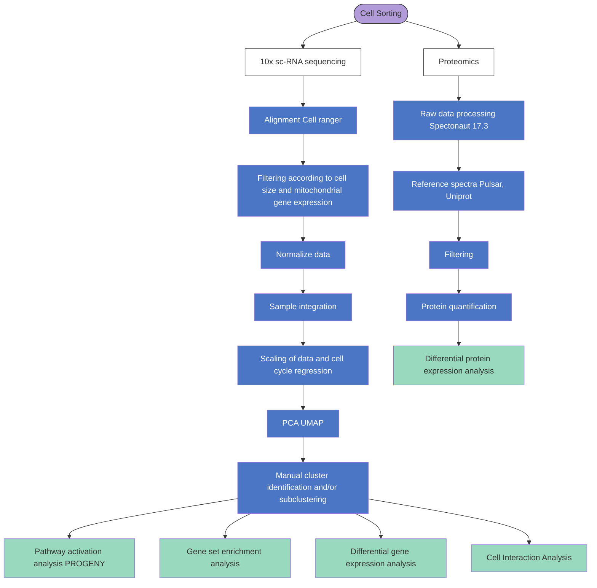

# EGFR Deletion in Myeloid Cells Reprograms the Immunosuppressive Landscape of Colorectal Cancer

Updated 2026-03-22

This repository contains R Markdown analyses for a manuscript focused on how EGFR positive myeloid cells promote an immunosuppressive environment in colorectal cancer (CRC).

The analyses span single-cell RNAseq, proteomics, and patient cohorts with survival information.

These analyses center on CRC tumor microenvironment biology across human cohorts and mouse models. Key outputs include:

- Cell-type annotation and immune profiling from scRNA-seq data.
- Differential expression and pathway analyses across bulk RNA-seq and proteomics.
- Cross-omics integration with clinical association and survival modeling.

## Repository hierarchy

```text
EGFR_myeloid_CRC/
├── README.md
└── scripts/
    ├── 01_scrna_mouse/
    │   ├── scRNA_Analysis_Renia.Rmd
    │   ├── limma_GSVA.Rmd
    │   ├── Cell_Commun_iTalk.Rmd
    │   └── Pathway_Analysis_PROGENy.Rmd
    ├── 02_scrna_human/
    │   └── Lee_Dataset_Analysis.Rmd
    ├── 03_proteomics/
    │   └── Comparison_Proteomics.Rmd
    └── 04_survival/
        └── Survival.Rmd
```

## Repository contents

- `scripts/01_scrna_mouse/scRNA_Analysis_Renia.Rmd`  
  Main scRNA-seq analysis workflow for the mouse CRC model using Seurat: QC, normalization, dimensional reduction, clustering, and cell-type annotation.
- `scripts/01_scrna_mouse/limma_GSVA.Rmd`  
  Differential expression and gene-set variation analysis (GSVA) on scRNAseq cell clusters using limma contrasts.
- `scripts/01_scrna_mouse/Cell_Commun_iTalk.Rmd`  
  Cell-cell communication analysis using iTALK with mouse-to-human orthology mapping.
- `scripts/01_scrna_mouse/Pathway_Analysis_PROGENy.Rmd`  
  PROGENy-based pathway activity scoring on mouse scRNA-seq data.
- `scripts/02_scrna_human/Lee_Dataset_Analysis.Rmd`  
  scRNA-seq analysis of the human CRC Lee dataset: alignment, integration, clustering, and immune profiling.
- `scripts/03_proteomics/Comparison_Proteomics.Rmd`  
  Proteomics data processing and differential protein expression comparisons across conditions.
- `scripts/04_survival/Survival.Rmd`  
  Survival modeling and GSVA-based signature validation on the human CRC cohort GSE39582.

## Analysis workflow


